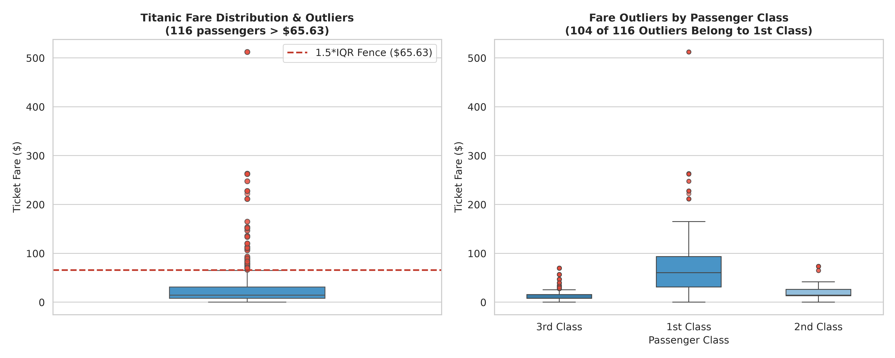
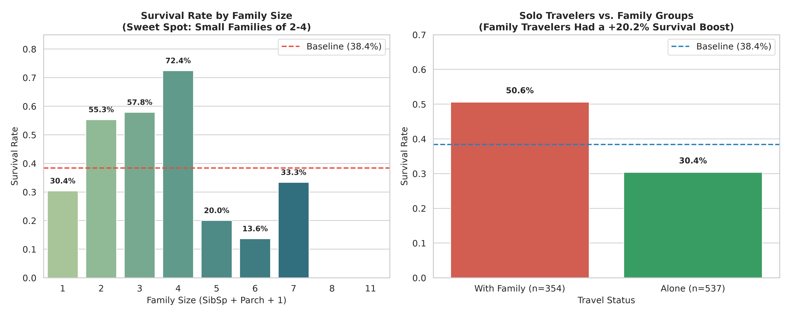
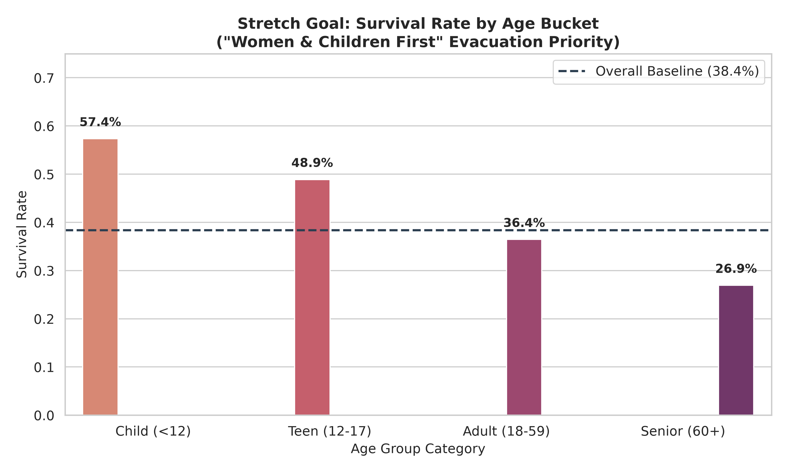

# 🚢 Titanic Data Cleaning & Feature Engineering (Week 2)

[](https://www.python.org/downloads/)
[](https://pandas.pydata.org/)
[]()

> **Curriculum Milestone:** Week 2 — Clean Data and Engineer Features  
> **Objective:** Transform messy, incomplete Titanic passenger data into a clean, model-ready dataset with engineered predictive features, categorical encodings, outlier treatments, and analytical justifications.

---

## 📁 Repository Structure

```text
titanic_data_cleaning_features/
├── data/
│   ├── titanic_raw.csv                 # Original raw Titanic passenger dataset (891 rows, 12 cols)
│   └── titanic_clean.csv               # Cleaned, engineered, model-ready dataset (891 rows, 16 cols)
├── charts/
│   ├── fare_boxplot_outliers.png       # Boxplot of Fare distribution and Pclass outlier breakdown
│   ├── survival_by_family_and_alone.png# Survival rate by family size & solo travel status
│   └── survival_by_age_bucket.png      # Survival comparison across life-stage age buckets
├── clean_data.py                       # Modular data cleaning & feature engineering pipeline
├── verify_submission.py                # Automated unit test suite verifying 'Done When' criteria
├── titanic_clean_and_engineer.ipynb    # Fully executed Jupyter Notebook with charts & markdown
├── build_notebook.py                   # Automated notebook generator and executor script
└── README.md                           # Documentation, insights summary & LinkedIn post draft
```

---

## 🔍 Data Cleaning Decisions & Justifications

| Feature | Missing Values | Strategy | Justification |
| :--- | :--- | :--- | :--- |
| **`Age`** | 177 (19.87%) | **Conditional Median by `Pclass` and `Sex`** | Age is right-skewed; median avoids outlier distortion. 1st class passengers were significantly older (median ~38 for males, ~35 for females) than 3rd class (median ~25 for males, ~21.5 for females). Conditional imputation preserves demographic reality. |
| **`Embarked`** | 2 (0.22%) | **Mode Imputation (`'S'`)** | Over 72% of all passengers embarked at Southampton (`S`). Imputing 2 rows introduces zero statistical distortion and preserves row volume. |
| **`Cabin`** | 687 (77.10%) | **Binary Indicator (`has_cabin`) & Drop Column** | 77% missingness makes string imputation speculative. However, cabin holders survived at **66.7%** vs non-holders at **30.0%**. `has_cabin` captures 100% of this signal while eliminating high-cardinality noise. |
| **`Fare`** | 0 in train | **Conditional Median by `Pclass`** | Fallback protection against missing test values (e.g., Kaggle test passenger 1044). |

---

## 🛠️ Feature Engineering Summary

1. **`family_size`** = `SibSp + Parch + 1`  
   Aggregates siblings, spouses, parents, children, and the passenger.
2. **`is_alone`** = `1` if `family_size == 1` else `0`  
   Captures solo traveler vulnerability.
3. **`has_cabin`** = `1` if `Cabin` was assigned else `0`  
   Proxy for upper-deck cabin proximity and socioeconomic privilege.
4. **`fare_per_person`** = `Fare / family_size`  
   Calculates the true individual ticket fare paid per passenger.
5. **`age_group`** (Stretch Goal) = `pd.cut(Age, bins=[0, 12, 18, 60, 120], labels=['child', 'teen', 'adult', 'senior'])`  
   Segments passengers into discrete developmental stages.
6. **One-Hot Encoding** = `pd.get_dummies()` applied to `Sex` and `Embarked` with `drop_first=True`  
   Yields `Sex_male`, `Embarked_Q`, and `Embarked_S` as integer columns.

---

## 📊 Key Findings & Visual Insights

### 1. Fare Outlier Analysis: Why We Kept the Luxury Outliers


- **116 passengers** had ticket fares exceeding the 1.5×IQR upper fence ($65.63).
- **104 of those 116 (89.7%) were 1st Class passengers.**
- The three highest fares ($512.33) belonged to the Cardeza family entourage occupying the luxury 3-room First Class Parlor Suite (B51-53-55).
- **Decision:** We **keep** the authentic fares. They represent genuine historical purchases rather than clerical data errors. For tree-based models, no transformation is needed; for linear/distance models, log-transform (`log1p(Fare)`) or 99th-percentile capping ($249.01) is recommended.

---

### 2. Family Size Dynamics: Solo Penalty & The "Sweet Spot"


- **The Solo Penalty:** Solo travelers (`is_alone == 1`) had a survival rate of **30.4%**, whereas passengers traveling with family had a **50.6%** survival rate (**+20.2 percentage point advantage**).
- **The Sweet Spot:** Small families of **2 to 4 members** experienced the highest survival rates (**55.3% to 72.4%**).
- **The Large Family Cliff:** Survival dropped precipitously for families of 5 or more (size 5: 20%, size 6: 13.6%, size 8+: 0%), as herding large groups to lifeboats in darkness was nearly impossible.

---

### 3. Stretch Goal: Age Buckets & Maritime Protocol


| Age Category | Age Range | Passengers | Survivors | Survival Rate |
| :--- | :--- | :--- | :--- | :--- |
| **Child** | < 12 yrs | 68 | 39 | **57.4%** |
| **Teen** | 12 – 17 yrs | 45 | 22 | **48.9%** |
| **Adult** | 18 – 59 yrs | 752 | 274 | **36.4%** |
| **Senior** | 60+ yrs | 26 | 7 | **26.9%** |

*Clear empirical evidence of the historic **"Women and children first"** evacuation order, with children surviving at nearly double the rate of seniors.*

---

## 🚀 How to Run & Verify

### 1. Run Data Cleaning Pipeline
```bash
python clean_data.py
```
*Outputs `data/titanic_clean.csv` and verifies zero missing values.*

### 2. Run Automated Verification Suite
```bash
python verify_submission.py
```
*Runs 6 unit tests confirming all "Done When" acceptance criteria.*

### 3. Regenerate Plots & Notebook
```bash
python generate_charts.py
python build_notebook.py
```

---

## ✅ Acceptance Criteria ("Done When" Checklist)

- [x] `clean_data(df).isnull().sum()` shows zero missing values in all cleaned columns.
- [x] Feature columns (`family_size`, `is_alone`, `has_cabin`, `fare_per_person`) contain correct and logically sensible values.
- [x] Categorical columns (`Sex`, `Embarked`) are purely numeric after encoding (`Sex_male`, `Embarked_Q`, `Embarked_S`).
- [x] `data/titanic_clean.csv` reloads into pandas with matching dimensions (891 rows, 16 columns) and 0 nulls.
- [x] Stretch Goal completed: `age_group` bucketed with `pd.cut` and survival rates compared across cohorts.

---

## 📱 LinkedIn Post Draft (Ready to Share!)

Copy and paste the template below to share your project and results:

```text
🚢 Week 2 Complete: Turning Messy Data into High-Signal Features (Titanic Dataset)

Cleaning data and engineering features is often called the "unglamorous" 80% of data science — but it's where models are won or lost.

Here is what I built and discovered this week:

1️⃣ Domain-Justified Missing Value Imputation:
Instead of blindly filling Age with a global average, I imputed missing values using the median grouped by Passenger Class and Sex. 1st-class men had a median age of 40, while 3rd-class women were 21.5 — context matters! Embarked was filled with the mode ('S', 72% frequency), and Cabin missingness was converted into a high-signal binary feature `has_cabin` (cabin holders survived at 66.7% vs 30.0%).

2️⃣ Feature Engineering Discoveries:
• The Solo Penalty: Traveling alone (`is_alone = 1`) resulted in a 30.4% survival rate, while traveling with family boosted survival to 50.6% (+20.2% jump).
• The Family "Sweet Spot": Small families (sizes 2–4) had the best survival rates (up to 72.4%). Beyond 4 members, survival collapsed to <20%.
• Age Bucketing (Stretch Goal): Children (<12) had a 57.4% survival rate vs. Seniors (60+) at 26.9% — a quantitative reflection of the historic "women and children first" maritime protocol.

3️⃣ Outlier Architecture (Fare):
Found 116 statistical outliers above $65.63, with 89.7% belonging to 1st Class. The $512 top tickets were real historical purchases (First Class Parlor Suites). Kept the authentic values for tree models while documenting 99th-percentile capping for linear models.

All cleaning steps were wrapped into a pure, immutable `clean_data()` function, verified with automated unit tests, and exported for Week 3 modeling!

🔗 Check out the full code and charts on GitHub: https://github.com/parwejalan0-lab/titanic-data-cleaning-features

#DataScience #MachineLearning #Pandas #FeatureEngineering #Python #DataAnalytics #EDA #Titanic
```
